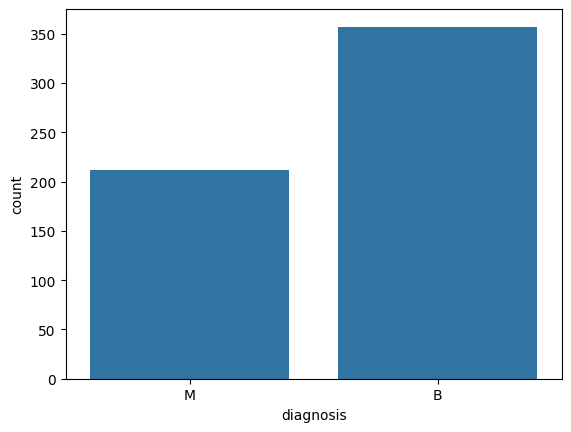

# Análise Exploratória de Dados de Câncer de Mama com Python

## O que diferencia um tumor maligno de um benigno? Uma análise exploratória com Python!
 
Projeto desenvolvido no Módulo 4 (visualização de dados com Python) da formação em Engenharia e Análise de Dados da [MCIO Brasil](https://mciobrasil.org.br/) em parceria com a [Leega Academy](https://leega.com.br/).
 
**Relatório completo:** [relatorio_cancer_de_mama.pdf](relatorio_cancer_de_mama.pdf)
 
---
 
## O pedido do hospital
 
Um hospital entregou uma base com 569 exames de câncer de mama e marcou uma reunião com uma pergunta de fundo: **o que esses dados dizem, e eles estão prontos para alimentar os algoritmos de IA da instituição?**
 
Na prática, a equipe queria cinco respostas:
 
1. Quantos casos são benignos e quantos são malignos?
2. Como os valores das medidas se distribuem?
3. Existem valores fora do padrão (outliers)? Eles atrapalham a IA?
4. Quais medidas realmente importam para identificar um tumor maligno?
5. Um painel para os médicos consultarem os dados sem precisar de código.
## Os dados
 
Os arquivos do material da aula não traziam a base de dados. Pelo conteúdo do relatório apresentado em aula, encontrei a mesma base no Kaggle e conferi que os números batiam (569 exames, 357 benignos e 212 malignos):
 
**[Breast Cancer Wisconsin (Diagnostic)](https://www.kaggle.com/datasets/uciml/breast-cancer-wisconsin-data)**
 
Cada linha é um exame feito a partir de imagens de células coletadas por punção. Além do diagnóstico (benigno ou maligno), cada exame traz 30 medidas que descrevem as células: tamanho (raio, perímetro, área), formato do contorno (concavidade, compacidade), textura, simetria, entre outras.
 
---
 
## O que os dados mostraram
 
### 1. Quase 4 em cada 10 exames são malignos
 
São **357 casos benignos (62,7%)** e **212 malignos (37,3%)**.
 

 
Há casos suficientes dos dois tipos para compará-los. Mas existe uma armadilha para a IA: um algoritmo que respondesse "benigno" para todo mundo acertaria 62,7% das vezes e, mesmo assim, não encontraria nenhum câncer. Por isso, um modelo deve ser avaliado principalmente pela quantidade de casos malignos que consegue identificar.
 
### 2. A maioria dos exames tem valores baixos, e poucos têm valores muito altos
 
Na maior parte das medidas, os exames se concentram em valores baixos, com uma minoria se estendendo para valores bem mais altos. As medidas também estão em escalas muito diferentes: a área passa de 2.000, enquanto outras ficam abaixo de 1. Antes de usar os dados em um algoritmo, é preciso colocá-los na mesma escala, para que os números grandes não pesem mais só por serem grandes.
 
### 3. Os valores fora do padrão não são erros: em sua maioria, são os casos mais graves
 
Quase todas as medidas (29 de 30) têm valores fora do padrão. A primeira reação seria descartá-los como erros, mas os dados contam outra história: nas medidas ligadas ao tamanho das células, **praticamente todos os valores extremos são tumores malignos**. Na área média, são 25 de 25.
 
Há uma exceção: na suavidade (erro padrão), 26 dos 30 valores extremos são de tumores benignos. Ou seja, nem todo valor fora do padrão significa a mesma coisa.
 
**Recomendação:** não remover esses valores automaticamente e validar com a equipe médica se eles são clinicamente plausíveis.
 
### 4. Tamanho e contorno irregular são os grandes sinais de alerta
 

 
A matriz de correlação mostra quais medidas andam juntas. Dois achados se destacam.
 
**Muitas medidas dizem a mesma coisa.** Raio, perímetro e área, por exemplo, estão praticamente 100% relacionados, o que faz sentido: quando uma célula cresce, as três medidas crescem juntas.
 
**Algumas medidas separam claramente os dois grupos.** Comparando a média dos exames benignos com a dos malignos:
 
| Característica | Benigno | Maligno | Diferença |
|---|---:|---:|---:|
| Área da célula | 462,79 | 978,38 | 2,1x maior |
| Concavidade (reentrâncias no contorno) | 0,046 | 0,161 | 3,5x maior |
| Pontos côncavos | 0,026 | 0,088 | 3,4x maior |
| Dimensão fractal | 0,063 | 0,063 | igual |
 
Nos tumores malignos, as células são maiores e têm contornos muito mais irregulares. Já a dimensão fractal é a mesma nos dois grupos e não ajuda a diferenciá-los.
 
**Recomendação:** priorizar as medidas de tamanho e de irregularidade do contorno e, entre as que repetem a mesma informação, manter apenas uma. Medidas que não mostram relação com o diagnóstico podem ser retiradas, desde que isso seja testado no próprio algoritmo.
 
### 5. Um painel para os médicos
 
O painel foi gerado com o Sweetviz, uma ferramenta que monta automaticamente um relatório navegável. Para cada medida, ele mostra média, mediana, mínimo, máximo, valores ausentes e um gráfico da distribuição, além de um resumo de como as medidas se relacionam. Os médicos podem explorar qualquer variável sem escrever uma linha de código.
 
- [Ver o painel online](https://htmlpreview.github.io/?https://github.com/danielli-arcari/analiseComSweetViz_hospital/blob/main/imagens/eda_cancer_sweetviz.html)
- [Painel em HTML](imagens/eda_cancer_sweetviz.html) (baixe e abra no navegador)
- [Painel em PDF](imagens/eda_cancer_conteudoHTML.pdf)
---
 
## A mensagem para o hospital
 
Se eu tivesse cinco minutos na reunião, a história seria esta:
 
> Dos 569 exames, pouco mais de um terço são malignos. O que separa os dois grupos é o **tamanho** e a **irregularidade do contorno** das células: nos malignos, a área é duas vezes maior e as reentrâncias, mais de três vezes. Os valores extremos que parecem erros são, em sua maioria, os casos mais graves, e precisam ficar na base. Como muitas medidas repetem a mesma informação, um conjunto menor e bem escolhido tende a ser suficiente para o algoritmo. O próximo passo é validar essas conclusões com a equipe médica e testá-las na IA do hospital.
 
*Exercício de análise exploratória para fins de estudo. Os resultados não têm finalidade diagnóstica.*
 
---
 
## O que acrescentei ao código da aula
 
O código completo está em [`datavizusandopython_mod4_leega.py`](datavizusandopython_mod4_leega.py). Para o exercício rodar com a base do Kaggle e com as versões atuais das bibliotecas, e para responder diretamente às perguntas do hospital, acrescentei estas linhas no Colab:
 
**Carregar o CSV direto do computador para o Colab**, lendo o arquivo enviado mesmo que o Colab altere o nome dele:
 
```python
from google.colab import files
 
arquivo = files.upload()
nome = list(arquivo.keys())[0]
cancer_data = pd.read_csv(nome)
```
 
**Remover a coluna vazia** criada por uma vírgula a mais no cabeçalho do CSV, que travava os boxplots:
 
```python
cancer_data = cancer_data.drop(columns=["Unnamed: 32"])
```
 
**Calcular a correlação só com as colunas numéricas**, exigência das versões atuais do Pandas:
 
```python
correlation_matrix = cancer_data.corr(numeric_only=True)
```
 
**Medir a relação de cada medida com o diagnóstico**, convertendo B = 0 e M = 1:
 
```python
from sklearn.preprocessing import LabelEncoder
 
diag = LabelEncoder().fit_transform(cancer_data['diagnosis'])
num = cancer_data.drop(columns=['id', 'diagnosis'])
num.corrwith(pd.Series(diag)).sort_values(ascending=False)
```
 
**Comparar as médias dos exames benignos e malignos:**
 
```python
cancer_data.groupby('diagnosis')[['radius_mean', 'area_mean', 'concavity_mean', 'concave points_mean', 'fractal_dimension_mean']].mean()
```
 
---
 
## Sobre o projeto
 
**Ferramentas:** Python, Google Colab, Pandas, NumPy, Seaborn, Matplotlib, Scikit-learn e Sweetviz.
 
**Arquivos:**
 
```
├── README.md
├── relatorio_cancer_de_mama.pdf        # relatório completo com o storytelling
├── datavizusandopython_mod4_leega.py   # código do exercício
├── cancer_data_kaggle.csv              # base do Kaggle
└── imagens/
    ├── diagnosis.png                   # distribuição do diagnóstico
    ├── Correlation Heat Map.png        # matriz de correlação
    ├── eda_cancer_sweetviz.html        # painel do Sweetviz
    └── eda_cancer_conteudoHTML.pdf     # painel do Sweetviz em PDF
```
 
**Instituições:** a [MCIO Brasil](https://mciobrasil.org.br/) é uma associação sem fins lucrativos que promove a inclusão e a ascensão de mulheres na tecnologia. A [Leega](https://leega.com.br/) é uma empresa de Dados, Analytics, Cloud e IA que também forma profissionais. Este projeto faz parte da formação realizada em parceria entre as duas.
 
**Autora:** Danielli Arçari | [LinkedIn](https://linkedin.com/in/danielli-arcari) | [Portfólio](https://danielliarcari.vercel.app)
